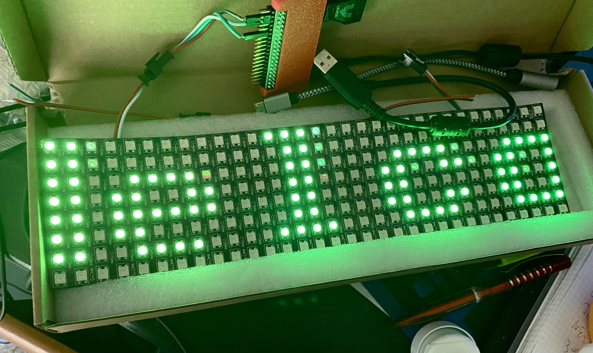

Raspberry Pi Neopixel Signboard
==========

The bulk of this code was shamelessly stolen from the https://github.com/rpi-ws281x/
project from which the majority of the code and the following sections of the README
were taken.



My changes were added to allow a scrolling text signboard (typically 8 pixels by something)
which you can make by adding a cheap NeoPixel array like the one at https://a.co/d/f1bIZp8
to something like a Raspberry Pi Zero W2. You can even chain multiple display together to
make the display even longer (set the "y") parameter on the test.

Run like:

`./neosign -x 8 -y 32 -m 'Hello, World! This is a test!'`

Pipe option allows you to specify a named pipe (`-p filename`). Subsequent writes to the named
pipe with update the display with the given text.

It will normally scroll text on pixels, but can alternateley present text "line by line"
with the `-f` ("flash") option.

# Colors
`./neosign  -y 64 -m $'\ecff00ffThis is a test of \ecffff00the emergency broadcasting \ec00ffffsystem' -S -f`

# Building

```
git submodule update --init --recursive
cmake .
make
```

# Test and Debug

The `-S` flag will write output to (ANSI) screen, and requires no pixels, as follows.

```
0         1         2         3         4         5         6
-123456789-123456789-123456789-123456789-123456789-123456789-123


 ████  ██  ██   ████  ██ ███   ███ ██  ████  █████   ████  ██  █
██  ██ ███████ ██  ██  ███ ██ ██  ██  ██  ██ ██  ██ ██  ██ ██  █
██████ ███████ ██████  ██  ██ ██  ██  ██████ ██  ██ ██     ██  █
██     ██ █ ██ ██      ██      █████  ██     ██  ██ ██  ██  ████
 ████  ██   ██  ████  ████        ██   ████  ██  ██  ████      █
                              █████                        █████

```

Note that sometimes very dim colors will show up as all black on some terminals.
To work around this, you may want to specify an explicit color with the `-C` flag like:

`./neosign  -y 64 -m "This is a test of the emergency broadcasting" -f -S -C 0xff00ff`

